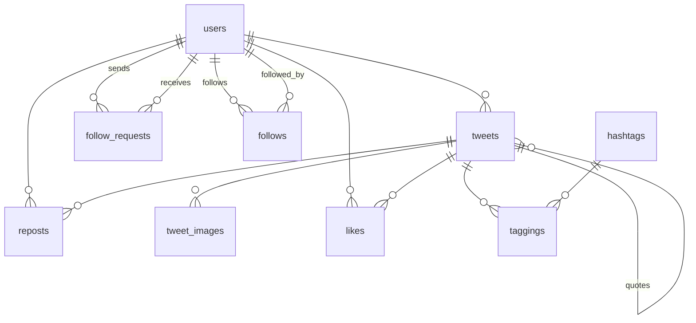

# tweet-practice
Ruby on Rails の設計力・実装力を鍛えるための学習用プロジェクト。
Twitter ライクなサービスをテキストなしで自力実装する。

## 機能一覧

### ツイート
- ツイート投稿・編集・削除（140文字以下、画像4枚まで添付可）
- 本文中の `#テキスト` を自動でハッシュタグとして登録
- 単純リポスト（コメントなし）
- 引用ツイート（コメントつきリポスト）
- いいね
- テキスト・ハッシュタグによる検索
- タイムライン表示（100件ずつページング）

### ユーザー
- ユーザー登録・プロフィール編集
- 認証：Google / GitHub / メールアドレス＋パスワード
- パブリック / プライベートアカウントの切り替え
- ユーザー検索

### フォロー
- パブリックアカウントへの即時フォロー
- プライベートアカウントへのフォローリクエスト（承認制）

### 公開範囲

|  | パブリック | プライベート | 未ログイン |
|---|---|---|---|
| ツイート投稿 | ○ | ○ | × |
| タイムライン | フォロー中のユーザー | フォロー中のユーザー |
全パブリックユーザーのツイート |
| ツイート詳細・検索 | フォロー中 + パブリックユーザー | フォロー中 +
パブリックユーザー | パブリックユーザーのみ |
| いいね・リポスト・フォロー・ユーザー検索 | ○ | ○ | × |

## ドメインモデル

| エンティティ | 説明 |
|---|---|
| `Tweet` | ツイート。`quoted_tweet_id` で引用ツイートを表現 |
| `Repost` | 単純リポスト。Tweet とは別エンティティ |
| `TweetImage` | ツイートに添付される画像 |
| `Like` | ユーザー × ツイートのいいね |
| `Hashtag` | ハッシュタグ（値オブジェクト） |
| `Tagging` | ツイート × ハッシュタグの中間テーブル |
| `User` | ユーザー |
| `Follow` | フォロー関係 |
| `FollowRequest` | フォローリクエスト（pending / approved / rejected） |

### PORO

| クラス | 責務 |
|---|---|
| `Timeline` | タイムラインのクエリロジック |
| `TweetSearch` | ツイート検索ロジック |
| `UserSearch` | ユーザー検索ロジック |
| `VisibilityPolicy` | アカウント種別による公開範囲の判定 |

### ER図

## 設計方針

- コントローラーにビジネスロジックを書かない
- ActiveRecord のコールバックは原則使わない
- 単一責任原則（SRP）とカプセル化を判断軸にする
- 複数モデルにまたがる処理はサービスオブジェクトに切り出す
- DBと紐づかないドメインロジックは PORO で表現する
- ツイート論理削除時に TweetImage は物理削除する

参考

- Rails Guides
- 『Railsアンチパターン』
- 『オブジェクト設計スタイルガイド』
