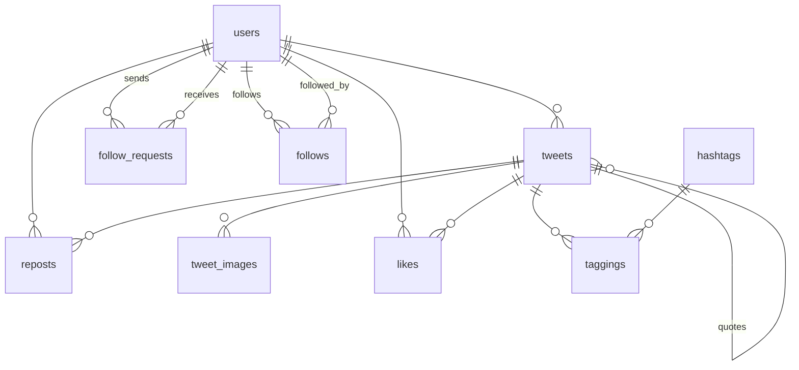

| キーワード                    | 英語            | 種別       | 理由                         |
| ------------------------ | ------------- | -------- | -------------------------- |
| ツイート                     | Tweet         | エンティティ   | ID をもち、状態が変わる              |
| ツイートの画像                  | TweetImage    | エンティティ   | ツイート一つに対して複数の画像が設定される      |
| いいね                      | Like          | エンティティ   | ユーザー×ツイートの関係として記録される       |
| 単純リポスト                   | Repost        | エンティティ   | コメントを持たないので、ツイートとは分ける      |
| 引用ツイート                   | -             | ツイートの一形態 | あくまでもツイートなので               |
| タイムライン                   | Timeline      | PORO     | DBに保存されない                  |
| ユーザー                     | User          | エンティティ   | ID をもち、状態が変わる              |
| ユーザー種別（ゲスト/パブリック/プライベート） | -             | ポリシー     | ユーザーの「種別」であり、可視性判定に使う      |
| フォローリクエスト                | FollowRequest | エンティティ   | 状態遷移を持つ。                   |
| フォロー                     | Follow        | エンティティ   | ユーザー同士の関連性                 |
| ツイート検索                   |               | PORO     | DBに保存されない                  |
| ユーザー検索                   |               | PORO     | DBに保存されない                  |
| ハッシュタグ                   | Hashtag       | 値オブジェクト  | ハッシュタグが同じなら同一とみなしても良さそうなため |
| タグ付け                     | Tagging       | エンティティ   | ツイート×ハッシュタグの関係として記録される     |

### Tweet
- id
- content
- user_id
- quoted_tweet_id(nullable)
- created_at
- updated_at
- deleted_at(nullable)

### User
- id
- name
- icon_image
- description
- visibility_type
- created_at
- updated_at
- deleted_at(nullable)

### Repost
- id
- user_id
- tweet_id
- created_at
- deleted_at(nullable)

### TweetImage
- id
- tweet_id
- image_url
- created_at
- updated_at

tweet の復活は基本的にユーザー側ではできないようにするので、tweet が削除された場合、tweet image は物理削除する。

### Like
- id
- tweet_id
- user_id
- created_at

### FollowRequest
- id
- follow_user_id
- followed_user_id
- status
	- フォロー申請中：pending
	- フォロー承認：approved
	- フォロー拒否：rejected
- created_at
- updated_at

### Follow
- id
- follow_user_id
- followed_user_id
- created_at

### Hashtag
- id
- name
- created_at

### Tagging
- id
- tweet_id
- hashtag_id
- created_at

以下没案
FollowEvent という Follow に関するイベントを記録し、それらを集計することで現在の Follow 状態を算出しようと思ったけど、今回のこの取り組みの目的は「Railsの設計力・実装力を鍛える」ことなので、イベントソーシング的な考えはやめて、今回はシンプルな形とした。

- id
- follow_user_id
- followed_user_id
- follow_status
	- フォロー申請中：published_follow_request
	- フォロー承認：approved
	- フォロー拒否：denied
	- フォロー解除：cancelled
- created_at
- updated_at

### ER 図

